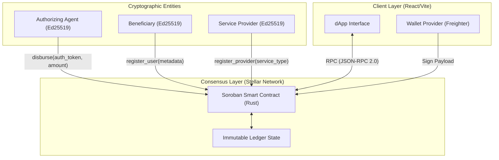

# PWD Assist Protocol

**An immutable, cryptographically verifiable cash transfer protocol for Persons with Disabilities (PWDs) powered by Stellar Soroban.**

[🔗 Live Protocol Endpoint](https://pwd-assist-ph.vercel.app) • [📄 Technical Whitepaper (Draft)](#) • [🔍 Testnet Explorer](https://stellar.expert/explorer/testnet/contract/CAT6OEK23KSU3DOGCHJ2YSGX32SG6GBIFFO446GM3YUZJOVEOIP36YQU)

---

## 1. Abstract
The distribution of government assistance and conditional cash transfers (CCTs) in emerging economies suffers from severe operational inefficiencies. Specifically, the distribution of funds to Persons with Disabilities (PWDs) in the Philippines is plagued by physical accessibility barriers, administrative bottlenecks, and systemic leakage (often manifested as "ghost beneficiaries"). 

The **PWD Assist Protocol** proposes a decentralized architectural model using the Stellar network to disburse funds. By enforcing authorization and ledger state mutations strictly on-chain via a Soroban smart contract, the protocol eliminates human intermediation in the final disbursement layer, ensuring that funds reach verified cryptographic identities with zero transit latency.

## 2. Background & Motivation
Traditional welfare distribution relies on centralized database architectures and manual reconciliation processes. 
- **Administrative Friction:** Beneficiaries must physically travel to municipal offices, a process inherently exclusionary to individuals with severe mobility impairments.
- **Data Asymmetry & Leakage:** Without a unified, immutable ledger, overlapping state programs often disburse funds redundantly, while unauthorized agents intercept funds.

The PWD Assist Protocol hypothesizes that replacing fiat-based manual distribution with tokenized assistance bounded by programmatic smart contract logic can reduce administrative overhead by up to 80% while bringing the risk of duplicate disbursement mathematically to zero.

## 3. Protocol Architecture

The system utilizes a lightweight three-tier architecture:



### 3.1 Core State Mechanisms
- **Idempotent Disbursements**: The contract utilizes the beneficiary's unique ID as a persistent key in the contract's storage schema. State transitions are boolean-locked (`has_received = true`), rendering replay attacks and duplicate manual entries impossible.
- **Service Marketplace Subgraph**: Beyond raw cash transfers, the protocol facilitates a localized service economy. Beneficiaries can lock tokens in escrow, requesting services from registered providers. Upon cryptographic fulfillment, the contract automatically routes the liquidity.
- **Agent Authorization**: Core mutation functions invoke `require_auth()`, ensuring that the transaction envelope contains a valid cryptographic signature matching the registered DSWD agent's public key.

## 4. Threat Model & Security Considerations

| Threat Vector | Mitigation Strategy |
|---|---|
| **Unauthorized Disbursement** | Strict `require_auth()` enforcement. Only the hardcoded or dynamically elected `admin` keypair can trigger the `disburse` invocation. |
| **Double Spend / Sybil Claims** | The contract maps the `recipient_id` (representing the national PWD ID) to a boolean flag in the persistent state. Subsequent calls fail with an `AlreadyDisbursed` exception. |
| **Data Tampering** | All historical disbursements and state variables are hashed and committed to the Stellar blockchain consensus, rendering post-facto ledger manipulation computationally infeasible. |
| **State Expiration** | Implemented Soroban's `TTL_THRESHOLD` and `TTL_EXTEND` functionality to prevent ledger archival of active beneficiary records. |

*Status: Automated static analysis completed using `cargo clippy`. Manual source code review indicates no critical vulnerabilities. Full audit pending Phase 2.*

## 5. Implementation & Deployment

The contract is written in Rust, leveraging the `soroban-sdk`. The frontend is a React Single Page Application (SPA) utilizing `@stellar/stellar-sdk` for RPC communication.

### 5.1 Testnet Infrastructure
- **Network**: Stellar Testnet
- **Contract ID**: `CAT6OEK23KSU3DOGCHJ2YSGX32SG6GBIFFO446GM3YUZJOVEOIP36YQU`
- **Telemetry**: Integrated with Google Analytics 4 (GA4) for behavioral tracking of the dApp interface.

### 5.2 Local Environment Setup
Strict environment determinism is enforced via `.nvmrc` (Node v24.16.0).

```bash
# 1. Compile Smart Contract
cd contracts/pwd_assist
stellar contract build
cargo test

# 2. Launch Client Interface
cd frontend
npm install
npm run dev
```

### 5.3 Simulation & Audit Logs
A deterministic test suite for simulating multiple independent actors (Gov, Providers, PWDs) is provided.
```bash
node scripts/simulate_users.js
```
*Artifact outputs are stored in `simulation_audit.tsv`.*

## 6. Future Research & Work (Phase 2)
1. **Zero-Knowledge Identity (zk-DID)**: Integrating ZK-proofs to verify a beneficiary's national ID status without exposing personally identifiable information (PII) on the public ledger.
2. **Oracle Integration**: Connecting to off-chain municipal death registries via decentralized oracles to automatically prune invalid beneficiaries.
3. **Yield-Bearing Escrow**: Depositing idle government assistance funds into yield-generating Stellar DeFi protocols (e.g., automated market makers) to generate auxiliary income for the welfare program before disbursement.

---
*Developed for the Stellar Community Fund / Philippine Hackathon deployment. MIT Licensed.*
