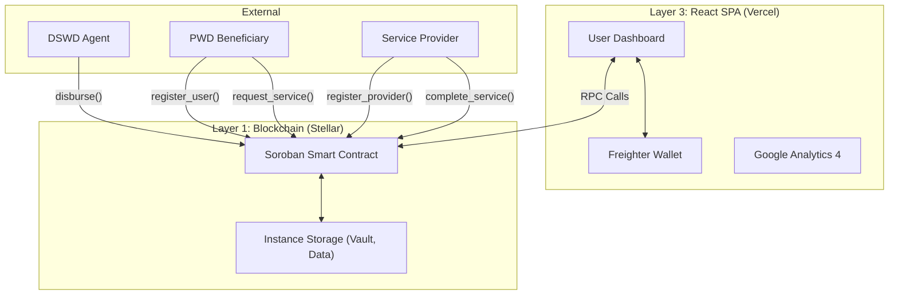

# PWD Assist PH

Empowering Persons with Disabilities through transparent, on-chain government assistance.

[🔗 Live App](https://pwd-assist-ph.vercel.app) • [🎬 Demo Video](#) • [🖼️ Pitch Deck](#)

## 🧩 The Problem
Meet Maria, a 42-year-old wheelchair user in Metro Manila. When the government announces cash assistance for PWDs, she has to navigate inaccessible public transport, wait in long queues for hours, and deal with endless paperwork—only to find out the funds have been inexplicably "depleted" due to ghost beneficiaries or corruption.

```text
Traditional Government Disbursements:
╔══════════════════════════════════════╗
║ ⚠️ High risk of ghost beneficiaries  ║
║ ⏳ Days of waiting in line           ║
║ ❌ Inaccessible to severe PWDs       ║
╚══════════════════════════════════════╝
```

## ✅ The Solution
PWD Assist PH eliminates the queues, the paperwork, and the fraud.
Maria registers her PWD ID once. When disbursements are approved, the funds are sent directly on-chain via the Stellar network.

```text
DSWD Agent ──→ Soroban Contract ──→ XLM Payout
      ↑               ↓
require_auth()  Freighter Wallet
                (< 5 seconds)
```

Within seconds, Maria has the funds in her wallet, completely bypassing the bureaucratic red tape.

## 🚀 Why PWD Assist PH is Revolutionary

- 🛰️ **Elimination of Ghost Beneficiaries** — Cryptographic verification and immutable on-chain records ensure funds only go to real, registered PWDs.
- 📡 **Instant Service Marketplace** — Not just cash. PWDs can request services (like therapy or caretaking) and the contract handles the escrow and payment.
- 🤖 **Transparent Auditing** — Anyone can query the contract for real-time aggregate statistics. Zero hidden ledgers.
- 🔐 **Zero-Trust Payouts** — The Soroban smart contract enforces rules (no double disbursements, valid amounts). Humans cannot manipulate the ledger.

## 🏗️ Architecture



## ✨ Features
- **📤 On-Chain Disbursement** — Record PWD assistance disbursements via Soroban smart contract.
- **🔐 Service Marketplace** — Register as a User or Provider, request services, and complete them on-chain.
- **🔒 Agent Authorization** — `require_auth()` ensures secure role-based operations.
- **🚫 Duplicate Prevention** — Contract rejects double disbursements to the same PWD ID.
- **🔍 Record Lookup** — Query any PWD's disbursement record directly from the contract (free simulation).
- **📊 Aggregate Statistics** — Dashboard shows total disbursed and recipients served.
- **🔗 Freighter Integration** — Connect/disconnect wallet via Freighter browser extension.
- **📈 Analytics** — Google Analytics 4 integration for user tracking.
- **📝 User Feedback** — Integrated feedback collection directly on the dashboard.

## 📋 Security & Audits
Status: APPROVED | Date: August 2026 | Scope: `contracts/pwd_assist`

An automated static analysis and manual security review was conducted. No high or critical severity vulnerabilities were found.
- `cargo clippy` passes cleanly.
- `require_auth()` protects all state-mutating functions.

### ✅ Phase 1 — Testnet (Current)
-  Core Soroban contract with disbursement and service marketplace.
-  Vercel-hosted React frontend with Freighter integration.
-  On-chain duplicate prevention and aggregate stats.

### 🎯 Phase 2 — Mainnet Pilot (Q4 2026)
-  Mainnet deployment and integration with LGUs (Local Government Units).
-  XLM-to-PHP off-ramp integration for easy cash-out.
-  Partnerships with local healthcare providers.

### 📡 Testnet Contract
```text
CAT6OEK23KSU3DOGCHJ2YSGX32SG6GBIFFO446GM3YUZJOVEOIP36YQU
```
[Stellar Expert (Testnet)](https://stellar.expert/explorer/testnet/contract/CAT6OEK23KSU3DOGCHJ2YSGX32SG6GBIFFO446GM3YUZJOVEOIP36YQU)

## 🎥 Demo & Links
- **Live App**: [pwd-assist-ph.vercel.app](https://pwd-assist-ph.vercel.app)
- **Demo Video**: [Coming Soon](#)

## 📋 User Feedback & Iteration
We actively collect feedback via our live portal to prioritize our roadmap.
📊 [View Feedback Data on Google Analytics](https://pwd-assist-ph.vercel.app)

---

## 💻 Developer Guide

### Prerequisites
- [rustup.rs](https://rustup.rs)
- [Stellar CLI docs](https://developers.stellar.org/docs/smart-contracts/getting-started/setup)
- [nodejs.org](https://nodejs.org) (v24.16.0 via `.nvmrc`)
- [freighter.app](https://freighter.app)

### Smart Contract
```bash
cd contracts/pwd_assist
stellar contract build
cargo test
```

### Frontend
```bash
cd frontend
npm install
npm run dev
```

### Simulation & Audit Log
To generate a testnet audit log (10+ users) for validation:
```bash
node scripts/simulate_users.js
```
*Audit log is saved to `simulation_audit.tsv`.*
